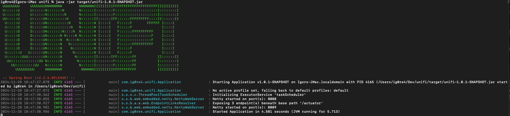
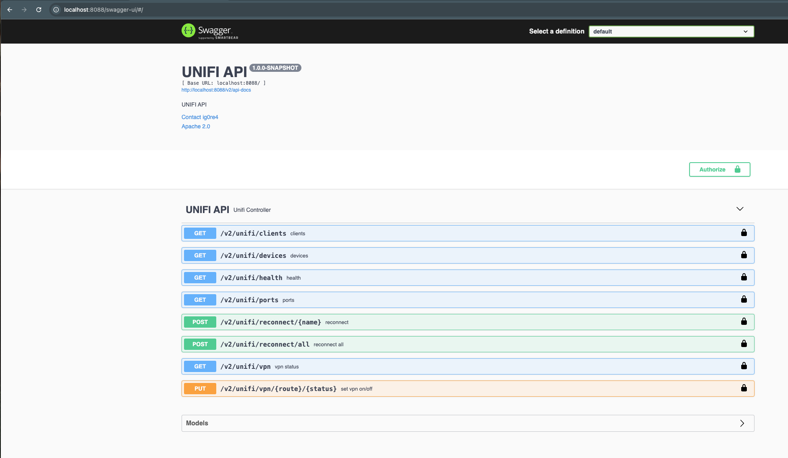

## UniFi application integrated with Ubiquiti Cloud Gateway Ultra Controller(UCG Ultra)

---
Please see [installation instructions](#Installation) below for more details.

## Supported Versions

| Software                             | Versions |
|--------------------------------------|----------|
| UniFi Network Application/controller | 8.X.X    |
| UniFi OS                             | 4.X      |                

## Description
This is a reactive spring boot application provides API for manage several following functionalities:
- get all network clients
- get all Ubiquiti network devices
- get all ports 
- get site health
- reconnect specific client
- reconnect all clients except localhost and defined in application.yml
- get traffic routes
- resume and pause specific traffic route

## Installation

- Install Java 11
- apply following environment variables:

```sh
export unifi_site=<your site name, for example - default>''
export unifi_site_username=<your ubiquiti account username>
export unifi_site_password=<your ubiquiti account password>
export unifi_username=<username for login to application, example - admin>
export unifi_password=<Bcrypted password for login to application, 
  example (admin) - $2a$12$p6uM2P2i1PEw6eTT4Wlq8uYXkJbY4zDLKFe89uIjV0jc3VMQEdN6C
```
- [download jar file](https://github.com/ig0re41k/unifi/releases/download/1.0.1/unifi-1.0.1-SNAPSHOT.jar) from release page.
- execute following command

```sh
java -jar unifi-1.0.1-SNAPSHOT.jar
```
- verify application is loaded


## Usage

- open swagger page - http://localhost:8088/swagger-ui/#/ in browser.



- click on "Authorize" and set credentials you applied in environment variables, for example admin/admin
- use Rest API defined bellow 

## Need help or have suggestions?

The work is in progress and your suggestions/comments are more than welcome. Please use the GitHub
[Issues section](https://github.com/ig0re41k/unifi/issues) to share your suggestions and questions.


## Important Disclaimer

Many of the functions in this API client class are not officially supported by Ubiquiti
and as such, may not be supported in future versions of the UniFi Controller API.
